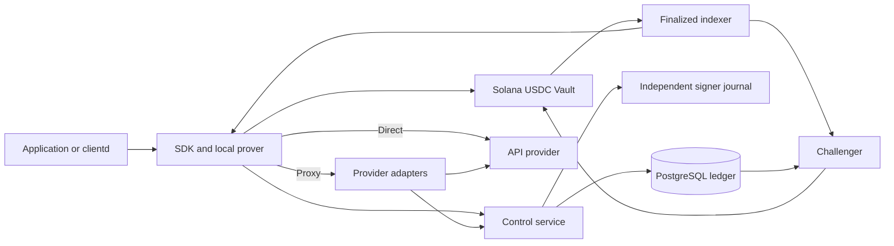

# Architecture

ZKAPI separates local custody, usage authorization, provider access and Solana
settlement. The same encrypted journal and accounting ledger serve direct and
proxy modes.

## Components

| Path | Responsibility |
|---|---|
| `packages/sdk/` | `ControlClient`, `WalletClient`, authorization, custody and recovery |
| `apps/clientd/` | Loopback API and native prover using the SDK journal |
| `programs/zkapi-vault/` | USDC custody, proof verification and atomic state transitions |
| `services/control/` | Authorization, direct/proxy adapters, ledger and signing services |
| `services/indexer/` | Finalized tree history and snapshots |
| `services/challenger/` | Challenge escaped states using retained authorizations |
| `crates/` | Circuit bindings, proof encoding, tree transitions and shared types |
| `vendor/ethereum-zkapi/` | Pinned request/withdrawal circuits, Poseidon and setup inputs |

## Invariants

- Balances, caps and withdrawals use integer micro-USDC; SOL covers fees and rent.
- One note has at most one unsettled authorization. Direct and proxy share its state.
- A single ledger writer and independent signer journal reserve and settle each operation once.
- Authorization binds exact quote bytes, provider, model, mode, tariff and recovery credentials.
- Unknown inference is never replayed. Unknown transactions keep their exact signed bytes.
- A new SDK or deployment profile cannot replace existing funded custody.
- Deposits activate only after finalized receipts and account reconciliation.
- Expired Active notes can transfer their full principal to the treasury; clients must expose expiry.

Layout 2 uses the original request/withdrawal circuits plus a proof-bound tree
transition. The program verifies all public inputs against actual accounts and
performs tree, state and USDC changes atomically. `v0_buffer` remains required;
compact deposits require both an authenticated manifest capability and a matching
independent build pin.

ZK proves balance and authorization conditions. It does not prove an API
response's correctness, provider deletion, proxy metering or network anonymity.
The pinned development setup is not a production ceremony.

## Specifications

- [On-chain protocol](specs/protocol-solana.md)
- [Tree transition](specs/tree-transition.md)
- [API, proxy and accounting](specs/api-proxy.md)
- [Operations and trust requirements](specs/operations.md)
- [Compact deposit](specs/compact-deposit.md)
- [OpenAPI](contracts/openapi.json), [ledger schema](contracts/ledger.sql),
  [wire contract](contracts/tree-transition.json), [binding vectors](contracts/binding-vectors.json)

## Design decisions

- [Proof-bound tree transitions](adr/0001-proof-bound-tree-transition.md)
- [Build-validated signing keys](adr/0002-build-validated-signing-keys.md)
- [Single-transaction deposits](adr/0003-single-transaction-deposit.md)
