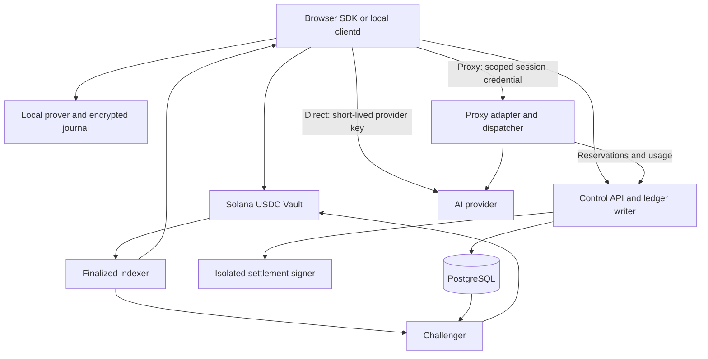

# Solana zkAPI architecture

Solana zkAPI funds AI API usage with USDC, proves authorization locally and
returns signed billing receipts and successor balances. The SDK and local
`clientd` share one authorization, accounting and recovery model. Applications
provide their own user interface, model selection and conversation history.

This document describes the protocol design. Available releases and verified
deployment behavior are listed in [support status](../status.md). The
[requirements](../specs/requirements.md) define the complete release scope;
they do not imply that every requirement has passed acceptance.

## Components and data flow

| Component | Responsibility | Source |
|---|---|---|
| Vault | USDC custody, note/tree transitions, withdrawals, escape and challenge | `programs/zkapi-vault/` |
| Shared types and crypto | Canonical wire types, hash bindings, integer accounting and proof verification | `crates/zkapi-solana-types/`, `crates/zkapi-solana-crypto/`, `crates/zkapi-layout2/` |
| Local provers | Request, withdrawal and tree-transition proof generation | `apps/clientd/prover/`, `crates/zkapi-tree-prover/` |
| Control and provider services | Quotes, durable authorization, reservations, provider adapters, receipts and signing | [Control](../../services/control/README.md), [providers](../../services/control/PROVIDERS.md) |
| Indexer | Reconstruct finalized tree state, verify accounts, serve paths and snapshots | [Indexer](../../services/indexer/README.md) |
| Challenger | Detect stale escapes, validate retained evidence and recover challenge transactions | [Challenger](../../services/challenger/README.md) |
| SDK | Trusted profiles, wallet operations, encrypted journals and response recovery | [SDK](../../packages/sdk/README.md) |
| clientd | Local compatible APIs and native custody using the shared SDK state machine | [clientd](../../apps/clientd/README.md) |

Proxy handlers process inference bodies. The ledger receives authorization,
usage and settlement data without prompts or responses. A common operator may
control both services, so this process separation does not hide proxy traffic
from that operator.

## Scope and privacy

The full release scope includes deposits, private notes, direct and proxy
authorization, signed settlement, mutual withdrawals, escape/challenge/expiry,
browser proving, native clients and recoverable service operations. Direct
adapters cover OA-org and OpenRouter. Proxy adapters cover OpenAI Chat
Completions and Responses, Anthropic Messages and OpenRouter Chat, including
text, client-executed tools and streaming where explicitly advertised.

| Mode | Inference route | Billing evidence and privacy boundary |
|---|---|---|
| Direct | Client to provider with a short-lived key | Prompts and responses bypass the payment service. Settlement uses the adapter's provider usage contract. |
| Proxy | Client to operator to provider | The operator can read prompts and responses. Usage comes from the proxy adapter; its signature does not independently prove the provider's usage. |

Zero-knowledge proofs establish balance and authorization conditions. They do
not prove response correctness, actual provider usage, provider deletion or
network anonymity. Providers receive prompts in both modes. IP addresses,
timing and content can still correlate activity. Clients select their mode
explicitly and never switch direct requests to proxy automatically.

Ollama compatibility, native SOL billing, arbitrary-destination HTTP proxying,
media and Realtime APIs, hosted tools and persisted provider conversations are
outside the initial scope. Unsupported request features must fail before
financial admission. API compatibility and compatibility with a particular
client version are separate; see the [client matrix](../integrations/README.md).

## Protocol and asset decisions

- Balances, caps, deposits and withdrawals use integer micro-USDC: one USDC is
  1,000,000 units. A deployment pins the Circle mint, six decimals and SPL Token
  Program. SOL pays network fees and rent separately from the note balance.
- The initial pricing policy charges one USDC per upstream USD with zero
  operator fee. This is a tariff policy, not a market-price guarantee. Quotes
  freeze the applicable tariff; ordinary billing requires no price oracle.
  Exact rational/decimal usage is accumulated before rounding, with one
  nano-to-micro round-up at session settlement. Cap overruns are operator losses.
- Request and withdrawal proofs retain the pinned Arkworks 0.5 BN254 Groth16
  circuits, Baby-JubJub signatures, note-binding construction and Poseidon
  rules. Their public input counts remain 12 and 14. Solana verification uses
  the dedicated crypto adapter and `groth16-solana`.
- The active tree has 32 levels. An additional Groth16 transition proof binds
  the old/new roots, note contents and operation through 11 public inputs. The
  program checks them against actual accounts and request/withdrawal proofs.
  Layout 2 uses `transition_proof` with `proof_bound` tags, as specified in
  [ADR-0001](../adr/0001-proof-bound-tree-transition.md).
- Domain-separated SHA-256 hash-to-field bindings include the complete genesis,
  program, pool, token program, mint and destination identities. The namespace
  `0x534f4c` is protocol-internal. Full Solana public keys are hashed with the
  specified framing; the binding is not a truncation or an injective encoding.
- Vault custody uses a PDA-controlled token account. Proof verification, tree
  and note updates and token transfers form one atomic instruction. Failed
  transfers roll back the financial and tree state together.
- Signed version-0 buffer transactions are the mandatory general transport.
  A trusted `v0_inline_deposit_v1` capability permits the compact single-
  transaction deposit in [ADR-0003](../adr/0003-single-transaction-deposit.md).
  Other formats require explicit capability declaration and verification.
- The design defaults are a 30-day note TTL rounded up to a day boundary and a
  24-hour challenge window. Actual deployment settings come from authenticated
  configuration. An expired Active note's entire deposit is claimable by the
  treasury; clients display expiry and warn seven days and one day beforehand.
- Role-specific state and clearance keys are fixed by validated builds under
  [ADR-0002](../adr/0002-build-validated-signing-keys.md). Quote, receipt,
  deployment, program administration and provider keys have separate roles.
  Existing pools do not silently acquire replacement keys or circuits.

The [protocol specification](../specs/protocol-solana.md) defines account layouts,
instructions, pause/expiry behavior and bindings. The
[tree-transition specification](../specs/tree-transition.md) and its
[wire contract](../contracts/tree-transition.json) define the proof and transport
bytes. These detailed contracts govern their respective interfaces.

## Authorization, settlement and recovery

The control API uses `/zkapi/v1`; compatible inference routes use `/v1`. One
pool has one financial writer and PostgreSQL ledger. Frontends may scale
independently, but they do not create separate accounting stores. Each note has
at most one unsettled authorization; the initial proxy concurrency limit is
four operations per session. Multiple operators use independent pools, keys and
ledgers without sharing balances.

Before authorization, the client durably encrypts the request identity, generated
credentials, exact quote and proof. Authorization binds deployment, mode,
provider, tariff, cap and credential hashes without a prompt, wallet address or
note ID. AUTH and CLEARANCE reservations permanently exclude each other for the
same pool/nullifier. Idempotent recovery preserves accepted bytes and does not
reapply an expired quote's admission deadline to an already accepted request.

Deposits become usable only after finalization. New authorization checks the
verified finalized root and independent RPC observations for on-chain exits.
Unknown or inconsistent chain state stops new admission. The same checks apply
before direct-key issuance and delivery. On-chain races are handled by retained
request proofs and the challenger.

Financial updates use the same PostgreSQL connection that holds the pool's
writer lock. Losing that connection stops writes. A dispatch attempt, owner and
epoch are durable before external execution; unknown inference is never
automatically replayed. A timeout alone does not prove that a dispatcher has
stopped. Settlement waits for completed attempts or independent fencing
evidence, and direct settlement also resolves key disable, usage and deletion.

Settlement fixes the charge, blind delta, next commitment, anchor and exact
signed bytes before requesting a signature. The isolated signer maintains a
separate durable journal keyed by pool/nullifier and rejects a second target.
Clients verify receipt arithmetic and successor signatures before committing
the new state. A zero charge still produces exactly one successor.

Direct provider keys are delivered only in the initial response. A missing key
uses the original control credential to close and recover, without reissuance.
Proxy status can recover financial state but cannot reconstruct a lost response
body. Unknown transaction outcomes use the recorded signature and bytes for
recovery; they do not authorize a replacement financial transaction.

Detailed state transitions and error behavior are defined by the
[API and accounting specification](../specs/api-proxy.md),
[OpenAPI schema](../contracts/openapi.json), [ledger contract](../contracts/ledger.sql)
and [client recovery guide](../getting-started/recovery.md).

## Deployment trust and operational boundaries

A separately trusted profile digest or distribution key authenticates deployment
inputs. The profile, manifest, chain identities, role keys, setup, proof assets,
IDL and declared transport capabilities must agree. A digest received only from
the same untrusted server cannot authenticate that server. Existing funded
custody retains its original profile, journal and namespace across upgrades.

Read-only preflight validates public inputs and chain state without opening
custody, obtaining a wallet signature, submitting authorization or running paid
inference. Passing it does not establish provider credit, successful inference,
withdrawal or continuous availability. Admission suspension keeps settlement
and recovery routes available where the underlying dependencies permit.

The production design isolates the signer and dispatcher, restricts provider
egress, fences old writers and dispatchers before failover, and verifies
restored ledger state against the retained signer journal. The challenger keeps
its own durable evidence and transaction checkpoints. Empty replacement
financial databases and journals are not recovery mechanisms.

Production qualification requires the complete cryptographic/transport,
accounting/recovery, live-provider and setup/review/operations gates in the
[operations specification](../specs/operations.md). Test setup artifacts,
synthetic providers and dated Devnet observations do not establish those gates.
Setup trust, program upgrade authority, challenge availability, pause behavior,
provider usage finality and expiry remain explicit trust boundaries.

Pinned upstream code, source hashes and licenses remain in
[vendor provenance](../../vendor/README.md) and
[third-party notices](../../THIRD_PARTY_NOTICES.md). Integration and operation
guides describe how to use this design; historical implementation checkpoints
are not additional protocol interfaces.
