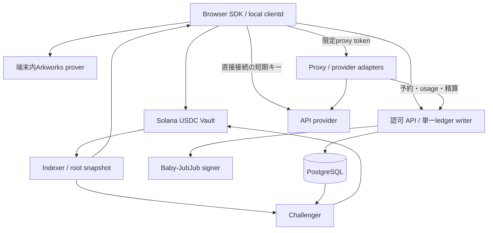

# Solana zkAPI — 実装開始仕様（layout 2）

2026-10-05 03:57 UTC（12:57 JST）更新：**OpenRouter proxy Chat toolsの実受入1caseが成功**。[HTTP 200・推論送信1回/再送0・`PROXY_USAGE`・18 micro-USDC請求・署名後継検証](evidence/I10-openrouter-tools-case-results.json)を確認し、[10,000,000 micro-USDCのdevnet入金→利用→mutual close](evidence/I10-openrouter-tools-runtime-results.json)も9 finalized取引・最大360,266 CU/1,232 bytesで完了した。wallet所有者がtreasury所有者を兼ねるため最終wallet 38,010,000/Vault 0となるが、明細の18 micro-USDC請求は別に検証した。[共通予算](evidence/I10-openrouter-tools-acceptance-results.json)は3case計57,831 micro-USDC予約・残り9,942,169。SSEはquote段階の失敗で未予約のまま。**全I10/G3と実Chrome＋Phantomは未完了**。

2026-10-05 JST、それまでの経緯：provider総額上限 **10 USDC** と **Chrome＋Phantom** は承認済み。[OpenAIモデル読取](evidence/I10-openai-model-access-node-results.json)と[OpenRouter通常キー読取](evidence/I10-openrouter-key-access-results.json)は認証HTTP 200を確認した。管理キー権限や実推論成功を示す結果ではない。最初の[OpenAI Responses試行](evidence/I10-openai-native-auth-initial-failure-results.json)は推論前のAUTHが不明となり、19,277 micro-USDCの試験予約を保持した。同じjournalの署名clearance→mutual closeで[10,000,000 micro-USDCのdevnet入金を全額回収](evidence/I10-openai-native-auth-recovery-results.json)した（9 finalized取引、最大338,395 CU/1,232 bytes、再送0）。OpenRouter plainは[実生成metadata](evidence/I10-openrouter-generation-usage-results.json)でnative入力14・出力2 token、実費0.0000033 USDを確認したが、計量受入は失敗し、署名済み`UNKNOWN_OPERATOR_LOSS`の利用者請求0と19,277 micro-USDC予約を維持した。原因は未確定で、推論再送・遡及課金はない。[通常SDK mutual close](evidence/I10-openrouter-native-withdrawal-results.json)で10,000,000 micro-USDCを全額回収した（9 finalized取引、最大355,063 CU/1,232 bytes、wallet 38,010,000・Vault 0）。これはprovider受入成功ではない。OpenRouter SSEは[quote 503](evidence/I10-openrouter-sse-quote-failure-results.json)で予算予約・AUTH・推論より前に停止し、未予約のまま[全額回収](evidence/I10-openrouter-sse-withdrawal-results.json)した（9 finalized取引、最大338,227 CU/1,232 bytes、wallet 38,010,000・Vault 0）。SSE回収時点の共通予算予約は既存2caseの38,554 micro-USDCだった。Chromeは2026-10-05 03:25 UTCにも[`ERR_BLOCKED_BY_CLIENT`](evidence/I10-chrome-current-block-results.json)を再確認した。**I10全体、G3、実Phantom受入は未完了**。

[SDK回復55件](evidence/I10-sdk-unaccepted-auth-race-results.json)、[UI local 39件](evidence/I10-wallet-ui-provider-local-results.json)、[表示改善後12件](evidence/I10-wallet-ui-provider-phase-results.json)は各source時点のoffline検証であり、合成proof/providerやWallet Standard fixtureを含む。実Phantom・実provider受入へ読み替えない。[18ケースの準備手順](provider-acceptance.md)の最大予約合計3.833884 USDCと、全profile共通の不変予算を維持する。[7段階回帰498.224秒](evidence/I10-provider-wallet-local-regression-results.json)は後続の選択profile・UI・AUTH回復変更前の履歴で、当時のsource409項目/I04入力不変とreport hash一致を保存した。

状態：**設計・インターフェース確定、実装着手可**。更新日：2026-10-04 JST。[layout 2設計確認](evidence/layout2-design-ready.md)と[従来の設計レビュー](evidence/design-review-2026-10-03.md)を参照。

**I10のlocal統合・負荷・障害試験を拡張**。[実行契約](i10-acceptance.md)、[要件対応表](i10-local-coverage.md)、[記録](evidence/I10.md)を参照。5 mode/provider・28 API case、実escape/control/challenge競合、反復faultを追加し、既存SDK/WASM/Go/運用を直列で再検証する。後に提供されたRPC/test keypairで専用devnet Vaultの実配備・Pool初期化・管理3命令、実入金→escape→finalizeの10取引finalizedまで確認した。1,000,000 micro-USDCのwallet/Vault残高復元、最大343,021 CU/1,232 bytes、入金ACK喪失後のfresh process復旧と再送0を[専用report](evidence/I10-devnet-wallet-escape-results.json)に保存した。mixed-v1読取、同一finalized cut、cap4の順序適用、byte一致のBase58変換を追加し、v0送信と検査を維持した。devnet差分後の[journal batching前の一括回帰](evidence/I10-devnet-local-regression-results.json)も7段階すべて成功、438.686秒（後続journal batching差分は別検証）。差分前458.202秒、I04回帰25.972秒（前回41.984秒）、各差分試験とtoolchain設定失敗を別source/hashで保存する。別の[mutual close受入](evidence/I10-devnet-wallet-mutual-results.json)も実control/PG/signerdのclearance署名を経て9取引finalized・最大347,571 CU/1,232 bytes・残高復元に成功。native daemon challengeの最新成功は次段落に記録し、未確認modeのprovider権限と実利用・wallet UIの受入は残る（総額10 USDCは承認済み）。I10全体・完了引継ぎReady・G1〜G4は未合格。

2026-10-05 JST更新：新しいchallenge-liveで受理済AUTH・zero-use精算→stale SDK escape→独立native daemon challenge→検証済後継のmutual closeが成功した。[wallet report](evidence/I10-devnet-challenge-wallet-results.json)は14finalized取引・最大353,022CU/1,232bytes・入金1,000,000micro-USDCの残高復元とexact-signature再送0、[native collector](evidence/I10-devnet-native-challenge-results.json)は別の5finalized取引・最大323,571CU/1,232bytesと正確なAUTH/payload/event/root結合を確認した。native再送回数は未計測で、検出から初execute送信まで173秒は単一jobの観測。停止は強制cleanup後clean_shutdown=falseを保持し、[同journal再読込](evidence/I10-devnet-challenge-restart-results.json)の成功をgraceful停止に読み替えない。先のchallenge-batched失敗と[資金回収](evidence/I10-devnet-uncertain-auth-recovery-results.json)は別履歴として保持する。実provider/G3とwallet UIの受入が残り、I10全体は未完了。追加provider/Phantom/停止修正前の[7段階local回帰](evidence/I10-final-local-regression-results.json)は399.016秒ですべて成功し、source/I04入力の不変を確認した。component別結果は`I10-final-local-components/`へ保存。438.686秒はjournal batching/回収helper追加前、458.202秒はdevnet差分前の履歴として保持する。

**I08/I09のlocal実装を追加し、受入証跡を更新した**。[local受入の対応表](evidence/I08-I09-local-acceptance.md)、[I08](evidence/I08.md)、[I09](evidence/I09.md)を読む。WASM/native prover、wallet、Go clientd、challenger RPC daemon/v0復旧、dispatcher/fencing、DB/WAL/signer復旧、private admin/監視/custodyを既存の単一SDK状態機械と共有ledgerへ接続した。[初期レビュー](evidence/I08-I09-review.md)と[開始契約](i08-i09-implementation-ready.md)は履歴・受入契約として保持する。[local受入後レビュー](evidence/I08-I09-local-review.md)で復旧・停止・管理APIの不備を修正し、既存基盤を再検証した。I10への完了引継ぎやG1〜G4合格は宣言しない。

現在地：**I01〜I09のlocal実装と検証を記録済み、本番・公開環境の受入は未完了**。[I06 direct](evidence/I06.md)・[I07 proxy](evidence/I07.md)・[I05](evidence/I05.md)で確立したadapters・Postgres ledger・独立signer journalを再利用した。実provider全modeの利用・精算、wallet UI、実Tor、production KMS/egress/fault-domain failover、署名配布、hosted CI、production setup/監査は未検証。元回路/profileと[署名公開鍵のビルド固定](adr/0002-build-validated-signing-keys.md)を維持する。

[I05レビュー](evidence/I05.md#2026-10-04-レビューとi06i07への引き継ぎ)で7件の問題を修正し、26テストと実Vault SBFを再検証した。このレビューでI06/I07実装着手Readyとなり、その後のlocal実装・検証は[I06](evidence/I06.md)・[I07](evidence/I07.md)に記録した。最終送信許可、発行済みkey参照の復旧、signerの料金表結合とjournal、障害時の受付停止/精算継続を共有台帳の契約として引き継ぐ。

[I04完了記録](evidence/I04.md)のbuffer全5操作、SDK署名v0、finalized indexer、復旧試験はそのまま再利用する。I04実SBFのbuffer 161取引＋SDK統合53取引、既存I03回帰366取引、最大426,830 CU / 1,232 bytesは歴史的な検証値として保持する。[I05実装引き継ぎ](i05-implementation-ready.md)にはPoolConfig/RPC境界、DB排他、署名journalと受入契約を残す。I05のRPC応答・usageはlocal fixtureを使うため、実providerや公開clusterでの成功は意味しない。

これはUSDC決済、Ethereum zkAPIの直接接続機能、第三者運営のproxyを含む本番向け仕様である。コード完成・性能検証・監査・mainnet配備の完了を意味しない。暗号互換性などの実測項目は、担当・判定基準・不合格時の処理を実装計画に固定した。

2026-10-04のI06/I07レビューで7件を修正し、59テスト・実Vault SBF 10取引（今回最大422,435 CU / 1,091 bytes）、SDK 26テストを再検証した。**I08/I09のlocal実装着手Ready**。[開始契約](i08-i09-implementation-ready.md)に順序・接続先・失敗時契約・受入試験を固定した。実provider/公開gate合格とはしない。

## 1. 読む順序と仕様の優先順位

1. 本書：スコープ、採用判断、コンポーネント。
2. [採用ADR](adr/0001-proof-bound-tree-transition.md)と[tree-transition実装契約](specs/tree-transition.md)：採用方式、11 inputs、proof/state結合、layout 2、prover、setup。
3. [オンチェーン・暗号仕様](specs/protocol-solana.md)：PDA、命令、証明、USDC転送。
4. [API・proxy・精算仕様](specs/api-proxy.md)：認可、課金、互換API、失敗時の状態遷移。
5. [運用・リリース仕様](specs/operations.md)：復旧、秘密管理、受入条件。
6. [実装タスク](implementation-plan.md)：依存順序、変更箇所、完了の証拠。
7. [OpenAPI](contracts/openapi.json)、[DBスキーマ](contracts/ledger.sql)、[決定論的テストベクトル](contracts/binding-vectors.json)、[layout 2 wire契約](contracts/tree-transition.json)。
8. [I05実装引き継ぎ](i05-implementation-ready.md)：完了したI05の成果物・transaction境界・受入契約。
9. [I06/I07実装引き継ぎ](i06-i07-implementation-ready.md)：provider adapters・配信/復旧契約・I08/I09への境界。
10. [I08/I09実装開始契約](i08-i09-implementation-ready.md)：SDK/clientdの実装順序、暗号化journalと署名検証、challengerの証拠・送信・復旧、運用受入。

新規Solanaインターフェースについては上記の仕様を正本とする。[従来の比較設計](production-parity.md)はEthereum版との対応表、[参照元記録](ethereum-reference.json)は観測事実である。参照元の実装詳細は固定commitを優先し、記事の説明から未実装機能を推測しない。仕様と固定コードの差が見つかったら差分を記録して修正し、無言で独自方式に変更しない。

## 2. 初回productionリリースの完成範囲

| 分類 | 必須 |
|---|---|
| 資金 | Circle発行USDCの入金、秘密note、精算、合意出金、escape、challenge、expiry |
| 認可 | Arkworksの実証明、nullifier一意予約、同一操作の復旧、署名付き後継残高 |
| 直接接続 | upstreamのOA-org経路とdirect OpenRouter経路。権限・実provider試験が必要 |
| proxy | OpenAI Chat Completions/Responses、Anthropic Messages、streaming、usage精算 |
| クライアント | browser SDK/WASM worker、Solana wallet、Go local clientd、localhost互換API |
| 運用 | indexer、challenger、秘密管理、DB復旧、監視、配布、ダッシュボード |

Ollama互換、native SOLでの利用料決済、任意URLへ中継する汎用HTTP proxy、batch/files/画像生成/音声/Realtime API、過去responseをサーバーに保存する機能は初回対象外。OpenAI/Anthropicの上記APIではテキスト、client側で実行するfunction/tool call、streamingを受け入れる。画像・文書入力とprovider側hosted toolは、費用上限とusageの確定が実証できるまで明示エラーにする。これはサンプルMVPの範囲ではなく、初回本番リリースの対応表である。

「Claudeが使える」「Claude Codeの全機能が動く」は別の受入基準。Messages互換を実装し、特定クライアントの対応はversionを固定した互換試験で公開する。モデル名はrelease manifestのallowlistで指定し、存在を確認していない将来モデル名を仕様に埋め込まない。

## 3. 採用する判断

| ID | 決定 |
|---|---|
| D01 | USDCの6桁整数を会計単位とする。残高、cap、出金すべてmicro-USDC |
| D02 | 通常料金はupstream 1 USD = 1 USDC。手数料0を初期profileとし、価格oracleを外す |
| D03 | request/withdrawal回路はupstream Arkworks 0.5系列を維持。新規mainnetのsetup方針は運用仕様で固定 |
| D04 | Groth16 BN254のSolana検証にLight Protocolのgroth16-solanaを採用する。byte変換は専用crate |
| D05 | 32段treeと元のPoseidonを維持。追加Groth16 tree回路が更新とtagを拘束、programは全11 inputsと実状態を照合。layout 2固定（ADR-0001） |
| D06 | 固定USDC mint・SPL Token Program・PDA authorityで保管。SOLはfee/rentだけ |
| D07 | 直接接続とproxyは同じnoteを使える。1 noteにつき未精算認可は1つ。session内proxy並列数は初期4 |
| D08 | proxyはOpenAI、Anthropic、OpenRouterの個別adapter。任意upstream URLと利用者からの上流credentialは受け付けない |
| D09 | Solana向け制御APIは `/zkapi/v1`。既存Ethereum HTTP wireとは別version。互換推論APIは `/v1` |
| D10 | Rust/Axum/Tokioを継続。DBはPostgreSQL、poolごとに単一の認可・署名writer。SQLiteのupstreamテストを移植する |
| D11 | セッション・制御操作の秘密は利用者が生成。再送時に同じ値を使う。plaintextをDB・ログへ保存しない |
| D12 | quoteの認可内容をバイト単位で固定。provider・model・料金表・mode・回復credentialを証明へ結合 |
| D13 | proxyの上流応答が不明なら再実行しない。計測不能分を利用者に推定請求せず、送信ownerの終了/fencing後に運営損失として確定 |
| D14 | ZKは残高と利用権限を証明する。API応答の正しさ、proxyの計測値、IP/本文の匿名性は保証しない |
| D15 | 入金の有効化はfinalized。認可時は独立RPCでも使用済みexit nullifierを確認。不明なら新規発行を停止 |
| D16 | root変更・状態変更・USDC転送は同一instruction。v0＋署名者/expected_digest付きbufferを必須・既定、v1は実証後の追加能力 |
| D17 | TTL 30日・日単位切上げ、challenge 24時間。原pause/expiry/逃避処理の条件を維持 |
| D18 | SDKがexpiryを明示し、期限7日前・1日前に警告。原方式ではexpiry後のActive元本全額がtreasuryへ行く |
| D19 | proxy利用時にはproxyが内容を読めることを接続前に表示。直接接続はprompt-free認可のみ |
| D20 | 初期運営は単一pool。複数運営者は独立pool/VK/鍵/DBで分離し、残高の相互利用はしない |

USDC方針以外の数値はこの設計の初期profileであり、デプロイ済み設定ではない。program ID、公開鍵、実provider credential、監視通知先は配備時の環境値。未設定のままproduction起動できない。

## 4. 構成



proxyは入力本文を処理するサービス、ledgerはprompt-free認可とusageを保存するサービスとして分割する。同一運営者が双方を管理するため、組織として内容を見ないという保証にはしない。

初期repo構成：

```text
vendor/ethereum-zkapi/       # 固定commit、license保持。I01で取得
crates/zkapi-solana-types/   # wire、H2F、quote、整数会計
crates/zkapi-solana-crypto/  # 元回路wrapper、VK/proof export、test vectors
programs/zkapi-vault/       # Anchor、token CPI、tree、verifier
services/control/          # Axum認可、ledger、署名、直接接続adapter
services/proxy/            # OpenAI/Anthropic/OpenRouter adapter
services/indexer/          # finalized tree、履歴・snapshot・path
services/challenger/        # 過去request proofによるchallenge
packages/sdk/              # TS + WASM + wallet標準
apps/clientd/              # upstream Go + Rust companionを移植
tests/{fixtures,svm,e2e,faults}/
deploy/                    # image digest、manifest、runbook
```

この仕様の初版作成時点では設計書・契約schema・テストベクトル・タスクのみを作成した。現在の実装・検証範囲は [I08/I09](evidence/I08-I09-local-acceptance.md) と [I01](evidence/I01.md)、[I02](evidence/I02.md)、[I03](evidence/I03.md)、[I04](evidence/I04.md)、[I05](evidence/I05.md)、[I06](evidence/I06.md)、[I07](evidence/I07.md) に記録する。runtimeディレクトリの存在だけで実装済みとはしない。

## 5. 実装開始と本番公開の境界

実装担当は[I08/I09のlocal受入](evidence/I08-I09-local-acceptance.md)と各runnerを起点に、残る公開環境の受入を確認する。既存のSDK・challenger・operationsを再実装せず、比較研究やbackend選択を最初からやり直さない。G1は全Vault/transportのCU・transactionサイズと統合動作、G2は精算・障害回復、G3は実provider、G4はsetup・鍵・監査・復旧演習を確認する。I04の実upload・署名・SBF・replayとI05の実Postgres・独立signer・新署名によるSBF出金はlocalで検証済みだが、実provider・wallet/clusterと全機能E2Eの検証は別途必要。

追加tree証明方式は採用済み。I02-Bのwire/verifier/bindingはI03へ統合済み。ソースアーカイブの権限差によるprofile不一致は修正し、再生成・実SBF再実行とチェックアウト条件を変えた回帰検査を[I02-B完了記録](evidence/I02B.md)に残した。新しい回路/VKを既存poolへ上書きしてはいけない。実装証拠が揃う前のmainnet配備は作業範囲に含まれない。


## 6. 今回固定した実装開始条件

- **選択済み**：元request/withdrawal/Poseidonを維持、tree Groth16追加、tagはproofで拘束、layout 2、新pool限定、v0_buffer必須。再度backend選択の確認を求めず実装する。
- **既存の証拠**：元6 proofとtree6 proof、標準baseline415ケース、研究用軽量化131ケースに加え、採用方式の257ケースを実SBFで検証済み。採用方式の最大317,443 CUは測定用account範囲の値で、公開前の全Vault測定を代替しない。
- **I02-Bで完成したもの**：tree回路/proverの独立crate、TreeUpdate型と固定wire、固定VKのSBF verifier、実状態とWP/RPを結合する共通検査、正常なproof同士を取り違えた負のfixture、empty root/profile生成、採用方式の再測定。固定profileの再現性は`python3 scripts/check_i02_reproducibility.py`で確認する。
- **I03で完成したもの**：全Vault命令・PDA署名CPI・ATA/PDA作成・status/N/Pending管理・イベント・IDL・同一EVM traceの差分試験。Anchor/SDK/Agaveをlockし実SBFで検証済み。公開鍵はADR-0002に従い役割別に固定する。
- **I04で完成したもの（local検証）**：buffer作成/追記/封印/中止、wallet送信とblockhash/競合/復旧、finalized indexer、最終account listと全送信単位のCU/bytes検証。
- **I05で完成したもの（local検証）**：Postgres migrationと専用writer connection、quote/proofの厳密結合、AUTH/CLEARANCE永久排他、整数予算・dispatch契約、署名明細、独立signer journal、process停止・復旧・ledger restore拒否、実Vaultへ接続した新署名の出金。I06/I07はこの共通台帳と署名サービスを利用する。
- **I06/I07で完成したもの（local検証）**：directの初回限定key配送・停止/usage/delete checkpoint・未知発行回収、4推論APIとcount_tokens・SSE・整数metering・同一台帳の予算/attempt/署名receipt・unknown waiver。実providerと本番egress/failoverは未検証。詳しくは[I06/I07引き継ぎ](i06-i07-implementation-ready.md)。
- **公開前に残るもの**：target cluster/walletでの全命令100万CU/transaction1232 bytes再確認、証明生成待ち時間と競合耐性、全機能E2E、実provider、3回路のproduction setup、第三者review。環境値/秘密の未発行はlocal実装の開始を止めない。

採用方式の性能不足が本番account処理の追加後に判明した場合は、検査を省かず計測結果をI02へ戻す。今回はrelease目標を変更していない。既知entropyのテスト鍵をproductionに使わない。
