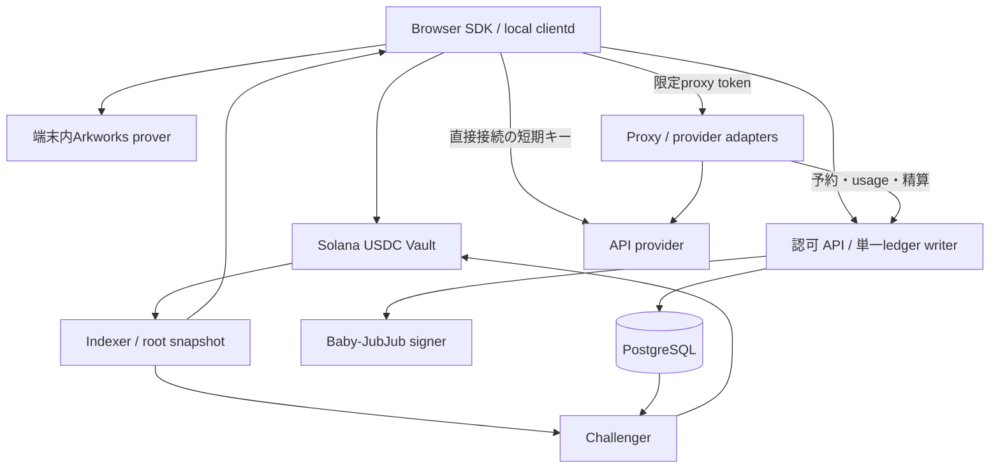

# Solana zkAPI — 実装開始仕様 v1

状態：**設計・インターフェース確定、実装着手可**。更新日：2026-10-03 JST。設計レビューの指摘と修正は[レビュー記録](evidence/design-review-2026-10-03.md)に残す。

実装レビュー後の現在地：I01 baselineはremote CI確認済み、I02基盤は修正・native検証済み。**次に着手できるのはI02のSBF/SVM・CU測定**で、I03開始にはI02完了が必要。[I02の引き継ぎ](evidence/I02.md)を読む。これはG1合格や本番公開Readyの宣言ではない。

これはUSDC決済、Ethereum zkAPIの直接接続機能、第三者運営のproxyを含む本番向け仕様である。コード完成・性能検証・監査・mainnet配備の完了を意味しない。暗号互換性などの実測項目は、担当・判定基準・不合格時の処理を実装計画に固定した。

## 1. 読む順序と仕様の優先順位

1. 本書：スコープ、採用判断、コンポーネント。
2. [オンチェーン・暗号仕様](specs/protocol-solana.md)：PDA、命令、証明、USDC転送。
3. [API・proxy・精算仕様](specs/api-proxy.md)：認可、課金、互換API、失敗時の状態遷移。
4. [運用・リリース仕様](specs/operations.md)：復旧、秘密管理、受入条件。
5. [実装タスク](implementation-plan.md)：依存順序、変更箇所、完了の証拠。
6. [OpenAPI](contracts/openapi.json)、[DBスキーマ](contracts/ledger.sql)、[決定論的テストベクトル](contracts/binding-vectors.json)。

新規Solanaインターフェースについては上記の仕様を正本とする。[従来の比較設計](production-parity.md)はEthereum版との対応表、[参照元記録](ethereum-reference.json)は観測事実である。参照元の実装詳細は固定commitを優先し、記事の説明から未実装機能を推測しない。仕様と固定コードの差が見つかったら差分を記録して修正し、無言で独自方式に変更しない。

## 2. 初回productionリリースの完成範囲

| 分類 | 必須 |
|---|---|
| 資金 | Circle発行USDCの入金、秘密note、精算、合意出金、escape、challenge、expiry |
| 認可 | Arkworksの実証明、nullifier一意予約、同一操作の復旧、署名付き後継残高 |
| 直接接続 | upstreamのOA-org経路とdirect OpenRouter経路。権限・実provider試験が必要 |
| proxy | OpenAI Chat Completions/Responses、Anthropic Messages、streaming、usage精算 |
| クライアント | browser SDK/WASM worker、Solana wallet、Go local clientd、localhost互換API |
| 運用 | indexer、challenger、秘密管理、DB復旧、監視、配布、ダッシュボード |

Ollama互換、native SOLでの利用料決済、任意URLへ中継する汎用HTTP proxy、batch/files/画像生成/音声/Realtime API、過去responseをサーバーに保存する機能は初回対象外。OpenAI/Anthropicの上記APIではテキスト、client側で実行するfunction/tool call、streamingを受け入れる。画像・文書入力とprovider側hosted toolは、費用上限とusageの確定が実証できるまで明示エラーにする。これはサンプルMVPの範囲ではなく、初回本番リリースの対応表である。

「Claudeが使える」「Claude Codeの全機能が動く」は別の受入基準。Messages互換を実装し、特定クライアントの対応はversionを固定した互換試験で公開する。モデル名はrelease manifestのallowlistで指定し、存在を確認していない将来モデル名を仕様に埋め込まない。

## 3. 採用する判断

| ID | 決定 |
|---|---|
| D01 | USDCの6桁整数を会計単位とする。残高、cap、出金すべてmicro-USDC |
| D02 | 通常料金はupstream 1 USD = 1 USDC。手数料0を初期profileとし、価格oracleを外す |
| D03 | request/withdrawal回路はupstream Arkworks 0.5系列を維持。新規mainnetのsetup方針は運用仕様で固定 |
| D04 | Groth16 BN254のSolana検証にLight Protocolのgroth16-solanaを採用する。byte変換は専用crate |
| D05 | 32段treeと元のPoseidonを維持。まずSBF同一hash実装を計測し、G1不合格時は定義済みtree-transition回路へ切替 |
| D06 | 固定USDC mint・SPL Token Program・PDA authorityで保管。SOLはfee/rentだけ |
| D07 | 直接接続とproxyは同じnoteを使える。1 noteにつき未精算認可は1つ。session内proxy並列数は初期4 |
| D08 | proxyはOpenAI、Anthropic、OpenRouterの個別adapter。任意upstream URLと利用者からの上流credentialは受け付けない |
| D09 | Solana向け制御APIは `/zkapi/v1`。既存Ethereum HTTP wireとは別version。互換推論APIは `/v1` |
| D10 | Rust/Axum/Tokioを継続。DBはPostgreSQL、poolごとに単一の認可・署名writer。SQLiteのupstreamテストを移植する |
| D11 | セッション・制御操作の秘密は利用者が生成。再送時に同じ値を使う。plaintextをDB・ログへ保存しない |
| D12 | quoteの認可内容をバイト単位で固定。provider・model・料金表・mode・回復credentialを証明へ結合 |
| D13 | proxyの上流応答が不明なら再実行しない。計測不能分を利用者に推定請求せず、送信ownerの終了/fencing後に運営損失として確定 |
| D14 | ZKは残高と利用権限を証明する。API応答の正しさ、proxyの計測値、IP/本文の匿名性は保証しない |
| D15 | 入金の有効化はfinalized。認可時は独立RPCでも使用済みexit nullifierを確認。不明なら新規発行を停止 |
| D16 | root変更・状態変更・USDC転送は同一transaction。legacy/v0 walletには署名者とexpected_digestに結合した一時bufferで対応 |
| D17 | TTL 30日・日単位切上げ、challenge 24時間。原pause/expiry/逃避処理の条件を維持 |
| D18 | SDKがexpiryを明示し、期限7日前・1日前に警告。原方式ではexpiry後のActive元本全額がtreasuryへ行く |
| D19 | proxy利用時にはproxyが内容を読めることを接続前に表示。直接接続はprompt-free認可のみ |
| D20 | 初期運営は単一pool。複数運営者は独立pool/VK/鍵/DBで分離し、残高の相互利用はしない |

USDC方針以外の数値はこの設計の初期profileであり、デプロイ済み設定ではない。program ID、公開鍵、実provider credential、監視通知先は配備時の環境値。未設定のままproduction起動できない。

## 4. 構成



proxyは入力本文を処理するサービス、ledgerはprompt-free認可とusageを保存するサービスとして分割する。同一運営者が双方を管理するため、組織として内容を見ないという保証にはしない。

初期repo構成：

```text
vendor/ethereum-zkapi/       # 固定commit、license保持。I01で取得
crates/zkapi-solana-types/   # wire、H2F、quote、整数会計
crates/zkapi-solana-crypto/  # 元回路wrapper、VK/proof export、test vectors
programs/zkapi-vault/       # Anchor、token CPI、tree、verifier
services/control/          # Axum認可、ledger、署名、直接接続adapter
services/proxy/            # OpenAI/Anthropic/OpenRouter adapter
services/indexer/          # finalized tree、履歴・snapshot・path
services/challenger/        # 過去request proofによるchallenge
packages/sdk/              # TS + WASM + wallet標準
apps/clientd/              # upstream Go + Rust companionを移植
tests/{fixtures,svm,e2e,faults}/
deploy/                    # image digest、manifest、runbook
```

この仕様の初版作成時点では設計書・契約schema・テストベクトル・タスクのみを作成した。2026-10-03 JSTからI01/I02に着手し、現在の実装・検証範囲は [I01](evidence/I01.md)、[I02](evidence/I02.md) に記録する。runtimeディレクトリの存在だけで実装済みとはしない。

## 5. 実装開始と本番公開の境界

実装担当はI01→I02から着手できる。G1は元証明とSolana verifierの互換性・CU/transactionサイズ、G2は精算・障害回復、G3は実provider、G4はsetup・鍵・監査・復旧演習を確認する。未実測のCU、未取得のprovider権限、元回路の流用可否を「合格」と記載していない。

G1失敗時も次の実装方式をprotocol仕様で定義済み。ただし新しい回路/VKを既存poolへ上書きしてはいけない。実装証拠が揃う前のmainnet配備は作業範囲に含まれない。
